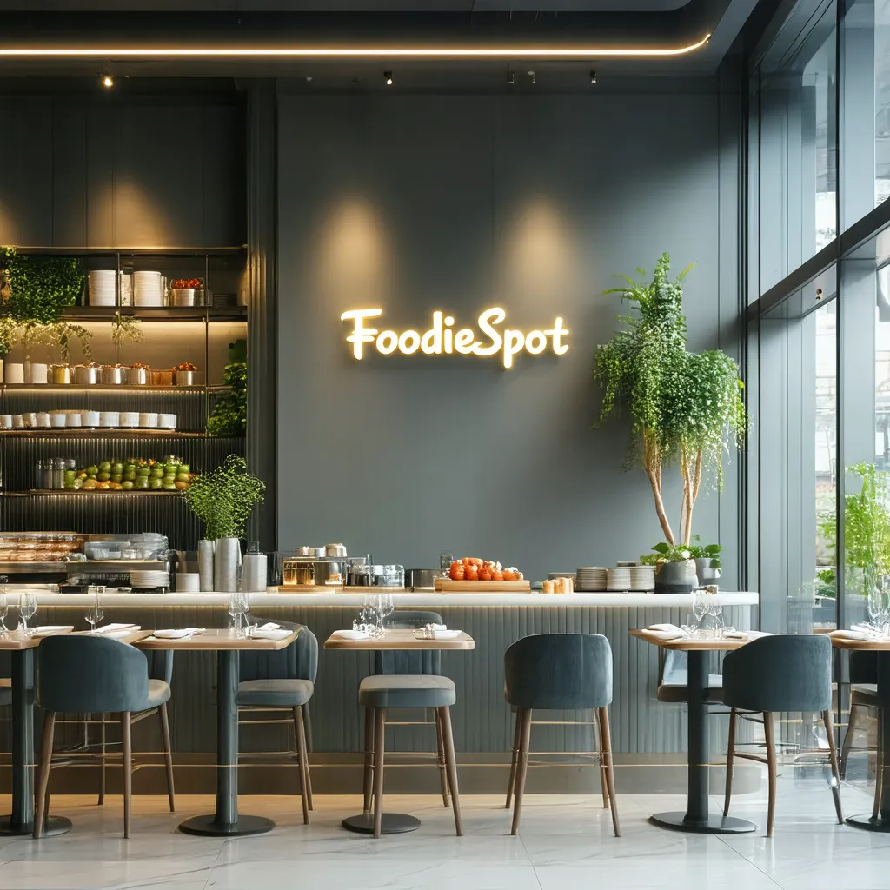

<!-- Improved compatibility of back to top link: See: https://github.com/othneildrew/Best-README-Template/pull/73 -->
<a name="readme-top"></a>
<!--
*** Thanks for checking out the Best-README-Template. If you have a suggestion
*** that would make this better, please fork the repo and create a pull request
*** or simply open an issue with the tag "enhancement".
*** Don't forget to give the project a star!
*** Thanks again! Now go create something AMAZING! :D
-->


<!-- PROJECT SHIELDS -->
<!--
*** I'm using markdown "reference style" links for readability.
*** Reference links are enclosed in brackets [ ] instead of parentheses ( ).
*** See the bottom of this document for the declaration of the reference variables
*** for contributors-url, forks-url, etc. This is an optional, concise syntax you may use.
*** https://www.markdownguide.org/basic-syntax/#reference-style-links
-->
<!--[![Contributors][contributors-shield]][contributors-url]
[![Forks][forks-shield]][forks-url]
[![Stargazers][stars-shield]][stars-url]
[![Issues][issues-shield]][issues-url]
[![MIT License][license-shield]][license-url]
[![LinkedIn][linkedin-shield]][linkedin-url]-->


<!-- PROJECT LOGO -->
<br />
<div align="center">

<h3 align="center">Conversational AI agent for Restaurant Reservation Management Process</h3>

  <p align="center">
    This repo includes the source code for developing a Conversational AI agent which can help make reservations at a Restaurant Chain with 30 locations. The agent suggests the restaurants based on the type of cuisine and seating preference of the customer. The application uses Groq for Llama 3.1-8b and it uses a Streamlit for the chat UI.
    
  </p>
</div>

You can access the Use case documentation on this Notion Page:
      [Use Case Doc](https://www.notion.so/Reservation-Management-Agent-Assignment-FoodieSpot-19115d7d10088033887af4be36d8d6eb?pvs=4)
    


<!-- TABLE OF CONTENTS -->
<details>
  <summary>Table of Contents</summary>
  <ol>
    <li>
      <a href="#about-the-project">About The Project</a>
    </li>
    <li>
      <a href="#prerequisites and installation">Prerequisites and Installation</a>
    </li>
    <li><a href="#Using the Streamlit App UI"></a></
    <li><a href="#license">License</a></li>
  </ol>
</details>


<!-- ABOUT THE PROJECT -->
## About The Project


In this project, a simple conversational AI agent is developed to streamline the reservation management process for FoodieSpot, a growing restaurant chain. The application uses Llama-3.1-8b from Groq api and the tool calling option is used with the tools `find_restaurants` and `make_reservation`. Depending on the intent of the customer's chat messages, the agent will call the respective tool to help them make a reservation. 

The main files in this repo are `appy.py`, `src/model/agent.py` and `src/utils_data/restaurant.py`. The file `app.py` contains the Streamlit app code and the file `src/model/agent.py` contains the code for the calling the model api from Groq along with the System prompt and the two tools the model uses. Finally the file `src/utils_data/restaurant.py` contains the function to generate the restaurant data and some helper functions.


The App's UI is developed using Streamlit and the customer can select the cuisine and seating preferences to find matching restaurants in the FoodieSpot restaurant chain. You can either use cuisine or seating or both to get the restaurant matches. An example reservation process is shown in the above GIF. There are also example videos of the app's functioning inside `Chatbot_video`.


<p align="right">(<a href="#readme-top">back to top</a>)</p>


<!-- GETTING STARTED -->
### Prerequisites and Installation

 For running this application, you will need a [GROQ API KEY](https://console.groq.com/playground). You can save the API key in a `.env` file with the variable name `GROQ_API_KEY` in the main folder of your local copy of this repo. You can run the project locally inside a virtual environment and use the below code to install the packages:
 
  ```sh
   pip install -r requirements.txt
  ```

If you are using [uv](https://docs.astral.sh/uv/pip/packages/#installing-a-package), you can install the packages using:
 ```sh
   uv pip install -r pyproject.toml
  ```
Note that the Python version is `>=3.12`.


<!-- ACKNOWLEDGMENTS -->
## License
The MIT License (MIT)

Copyright <2025> Harikrishnan D

Permission is hereby granted, free of charge, to any person obtaining a copy of this software and associated documentation files (the “Software”), to deal in the Software without restriction, including without limitation the rights to use, copy, modify, merge, publish, distribute, sublicense, and/or sell copies of the Software, and to permit persons to whom the Software is furnished to do so, subject to the following conditions:

The above copyright notice and this permission notice shall be included in all copies or substantial portions of the Software.

THE SOFTWARE IS PROVIDED “AS IS”, WITHOUT WARRANTY OF ANY KIND, EXPRESS OR IMPLIED, INCLUDING BUT NOT LIMITED TO THE WARRANTIES OF MERCHANTABILITY, FITNESS FOR A PARTICULAR PURPOSE AND NONINFRINGEMENT. IN NO EVENT SHALL THE AUTHORS OR COPYRIGHT HOLDERS BE LIABLE FOR ANY CLAIM, DAMAGES OR OTHER LIABILITY, WHETHER IN AN ACTION OF CONTRACT, TORT OR OTHERWISE, ARISING FROM, OUT OF OR IN CONNECTION WITH THE SOFTWARE OR THE USE OR OTHER DEALINGS IN THE SOFTWARE.


<p align="right">(<a href="#readme-top">back to top</a>)</p>


<!-- MARKDOWN LINKS & IMAGES -->
<!-- https://www.markdownguide.org/basic-syntax/#reference-style-links -->

[license-shield]: https://img.shields.io/github/license/DOOMNOVA/A_p_test.svg?style=for-the-badge
[license-url]: https://github.com/DOOMNOVA/A_p_test/blob/master/LICENSE.txt


